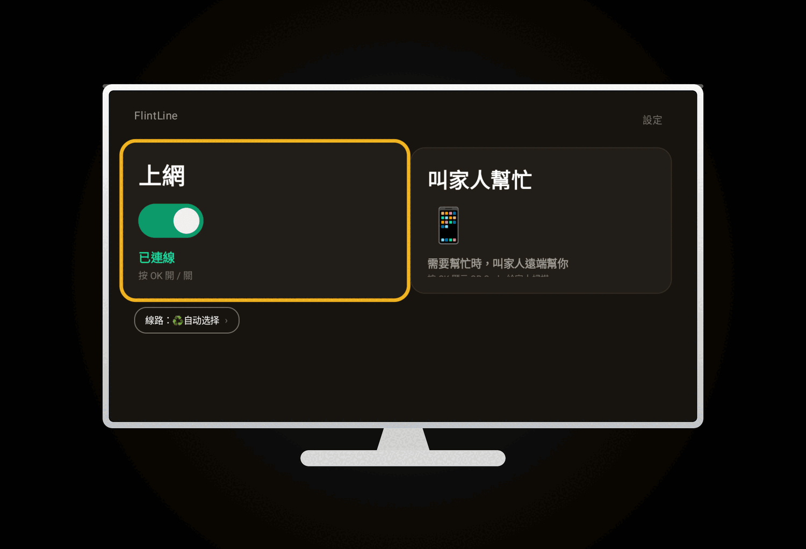
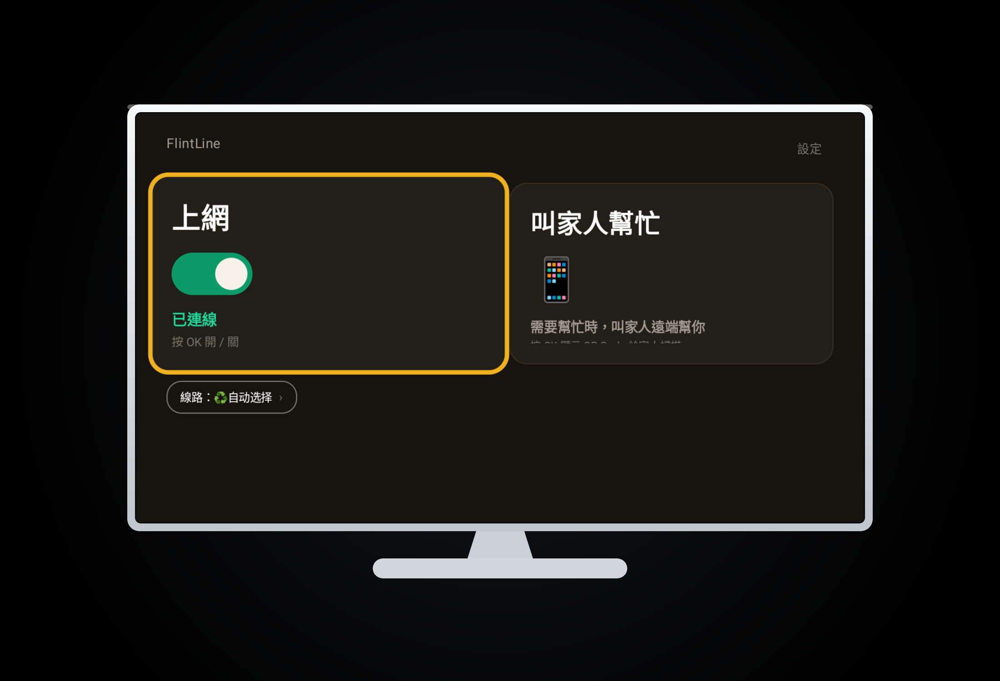
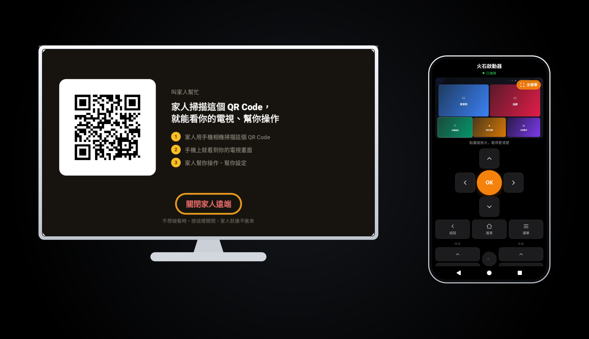

# 📺 FlintLine 火石線路 

專為**海外長輩華人**打造的電視盒子（TVbox）專用開源助手。基於 **Clash 強大分流內核**進行二次開發，整合客製化極簡電視 UI 與免裝 APP 的手機網頁遠端助理。純公益、完全免費無廣告。

🌐 **Notion 詳細圖文教學官網（電視內建瀏覽器直刷短網址）：** [51999.uk](https://51999.uk)
👉 [📖 點此前往詳細圖文教學（Notion 外部連結）](https://51999.uk)

---

## 🎬 實時遠端遙控動態演示 (Demo)

  

---

## ⚡ 核心優勢與功能 (Core Features)

* **🚫 100% 免 Root、免越獄**：純後台系統級優化外掛，開箱即用，絕對不傷電視盒原廠保固。
* **🔑 免註冊、零帳號極簡體驗**：拒絕繁瑣流程，APK 下載安裝後即可一鍵啟動跨國連線，無需註冊任何帳號。
* **🌐 火石線路 · 海外加速器**：內建優化跨境路由，完美解決海外安博盒子因區域限制轉圈圈、看不了的痛點。
* **📱 免 App 手機網頁遙控**：晚輩手機免裝任何應用程式，直接用瀏覽器網頁就能跨國實時控制電視，遠端幫長輩打字搜劇、切換 APP、線上排查疑難雜症。
* **🔒 100% 保留原廠桌面**：本版本（FlintLine）解耦了桌面功能，做成純後台外掛，完全不干涉原本電視盒的原廠介面，長輩操作不恐慌。

---

## 📸 軟體介面截圖 (Screenshots)

 
<table align="center">
  <tr>
    <td align="center" valign="top"> 功能啟動介面</td>
    <td align="center" valign="top"> 遠端連線配對</td>

  </tr>
</table>

---

## ⚠️ 當前專案限制與防禦說明 (誠實說明)

1. **頻寬與註冊名額限制（超級重要）**：
   本專案目前使用的是作者個人的**閒置伺服器**，頻寬跟資源非常有限。**因為資源有限，如果註冊滿了就不會再開放新用戶，屆時將會關閉新用戶的擠入管道**！如果真的有需要的朋友，建議儘早下載測試，也請大夥多加體諒。
2. **播放與設備限制**：
   為了避免頻寬資源遭到惡意擴展與浪費，**目前軟體僅支援安博盒子 (Unblock Tech) 官方的 APP 播放**。智慧電視和手機尚未進行相容性測試，恐怕無法正常運作。
3. **客製化相容許願**：
   如果您是使用小雲盒子 (Svicloud) 或其他品牌也有相同需求，歡迎在 GitHub 提交 Issue 留言。人數多的話，我後續會考慮安排客製化相容開發。

---

## 🛠️ 下載與相容性 (Releases)

* 本專案目前在 Android 7.0+ 老舊電視盒測試通過。
* 喜歡「VPN ＋ 遠端遙控」獨立外掛的朋友，請在 Release 頁面下載最新 **FlintLine APK**。
* 如果您需要換掉原廠介面，給長輩使用超大字體的電視桌面(https://github.com/acatflow/flint_tv_launcher)。

👉 [📥 前往 GitHub 發佈頁下載最新 APK 安裝包](https://github.com/releases)

---

## 💝 支持與指教

本專案由作者阿正個人獨立維護，純公益完全免費。**如果您覺得有幫到您老家的長輩，請幫忙轉發，並順手幫我點個 Star 🌟 鼓勵一下，這是我持續燃燒肝臟的最大動力！**

有任何新的功能需求、Bug 回饋，歡迎隨時提交 Issue，或者在 Twitter (X) 上關注我。
